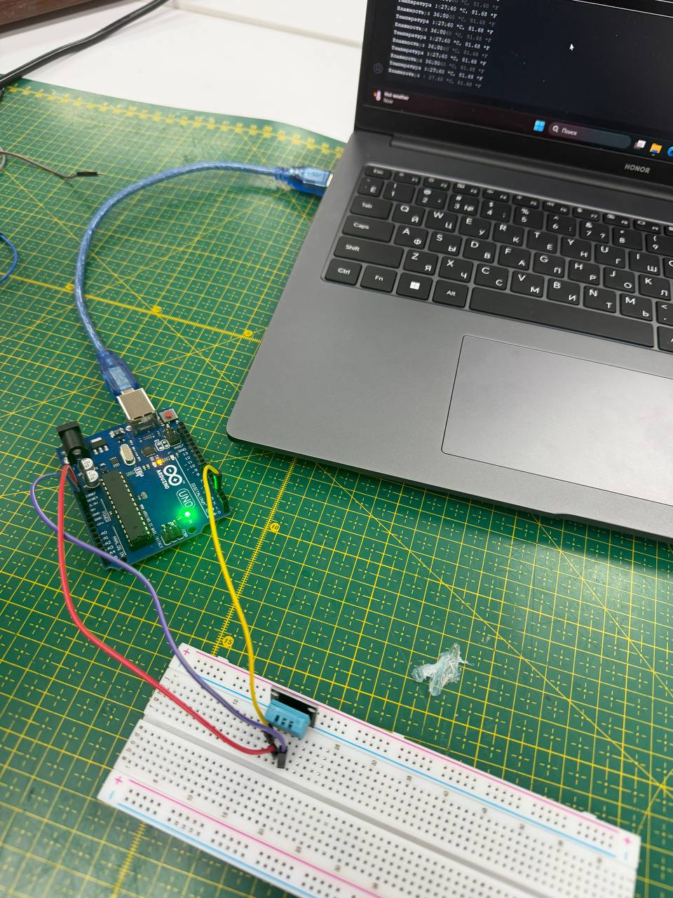
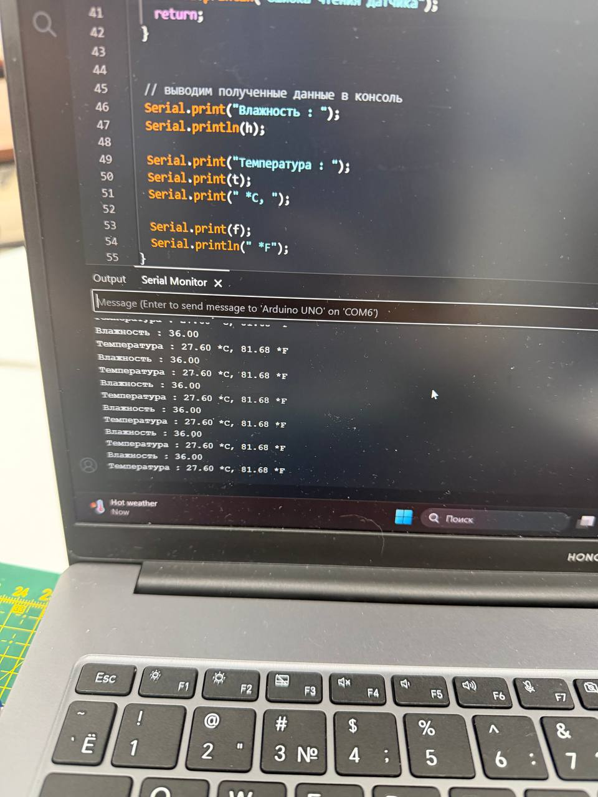

# DHT11 Room Monitor

A beginner Arduino project that measures room temperature and humidity using an Arduino Uno and a DHT11 sensor.

## Components

* Arduino Uno
* DHT11 sensor
* Breadboard
* Jumper wires

## Result

